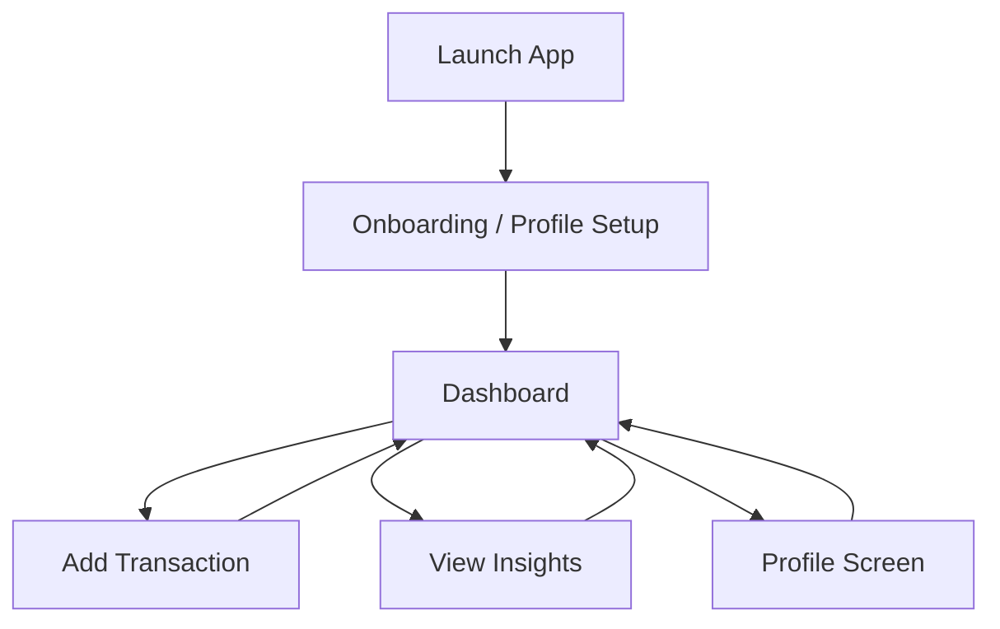
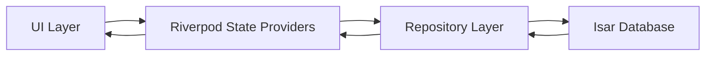
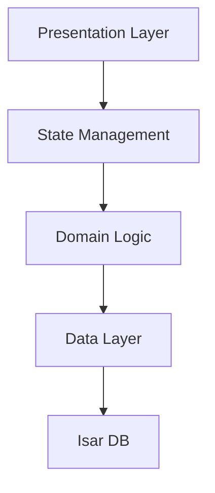
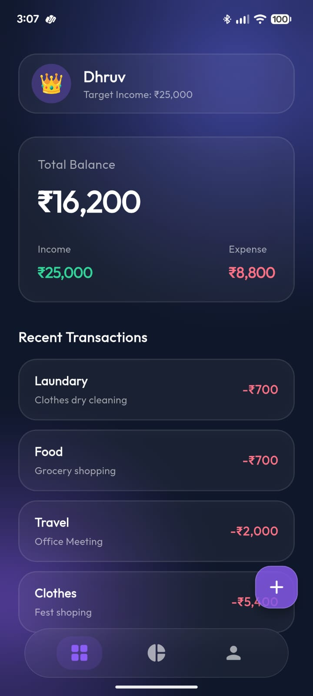
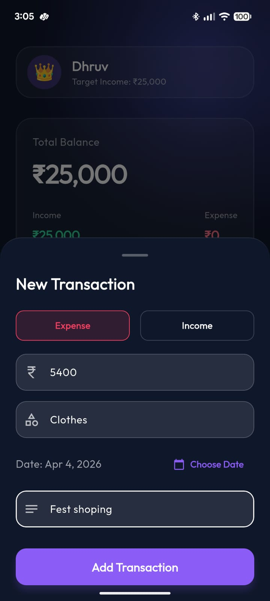
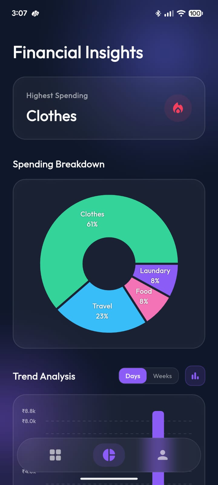
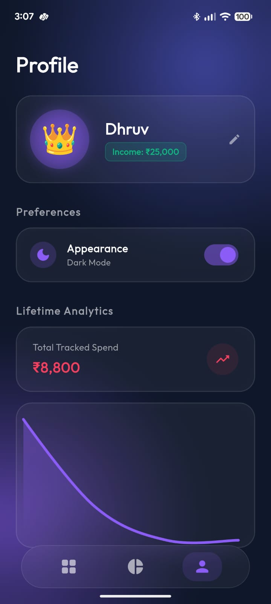
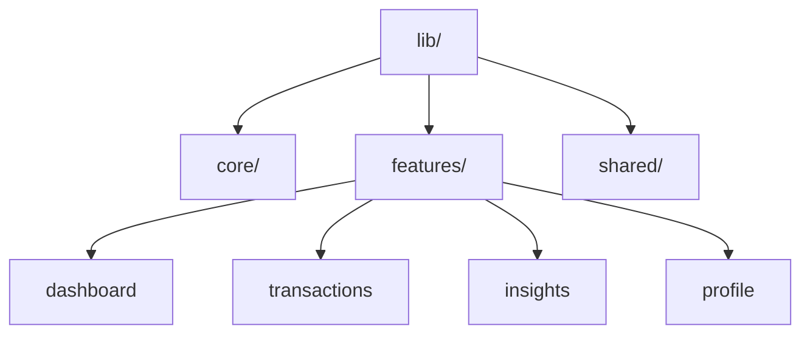

# SpendWise

SpendWise is a modern personal finance application built with Flutter. It focuses on clean UX, real-time tracking, and structured insights to help users understand and control their spending habits.

---

## Overview

SpendWise allows users to:
- Track income and expenses
- View real-time balance updates
- Analyze spending patterns through insights
- Maintain streaks for disciplined spending
- Manage personal financial profiles

---

## User Flow



---

## Data Flow



---

## Architecture



---

## Features

- Real-time transaction tracking
- Monthly and lifetime analytics
- Category-based expense breakdown
- Glassmorphic premium UI
- Local database with Isar
- Reactive state management with Riverpod

---

## Screenshots

<p align="center">
  
  
  
  
</p>

<p align="center">
  <sub>Dashboard</sub> &nbsp;&nbsp;&nbsp;&nbsp;&nbsp;&nbsp;&nbsp;&nbsp;
  <sub>Add Expense</sub> &nbsp;&nbsp;&nbsp;&nbsp;&nbsp;&nbsp;&nbsp;&nbsp;
  <sub>Insights</sub> &nbsp;&nbsp;&nbsp;&nbsp;&nbsp;&nbsp;&nbsp;&nbsp;
  <sub>Profile</sub>
</p>

---

## Download APK

[Download APK](YOUR_GOOGLE_DRIVE_LINK_HERE)

---

## Getting Started

### Clone the repository

```bash
git clone https://github.com/DhruvChaurasia9403/Spendwise.git
cd spendwise
```

---

### Install dependencies

```bash
flutter pub get
```

---

### Generate required files

```bash
dart run build_runner build --delete-conflicting-outputs
```

---

### Run the app

```bash
flutter run
```

---

## Project Structure



---

## Tech Stack

- Flutter
- Riverpod
- Isar Database
- fl_chart
- Google Fonts

---

## Notes

- Generated files (*.g.dart) are excluded from version control
- Ensure build_runner is executed before running the app
- Designed for performance with optimized UI rendering

---

## License

This project is private and not intended for public distribution.
