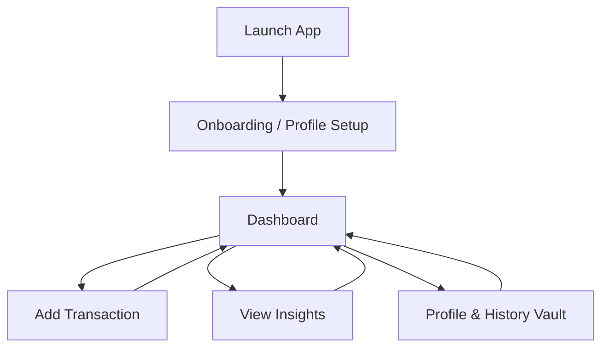
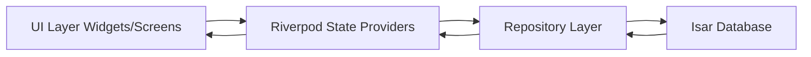
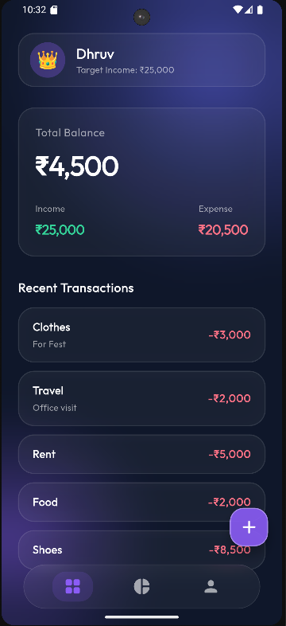
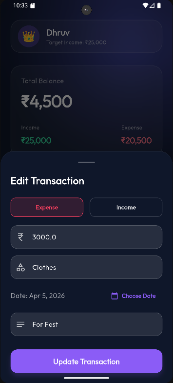
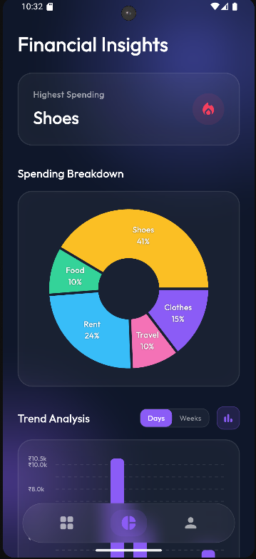
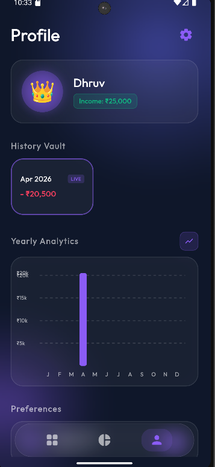

# SpendWise: Intelligent Personal Finance

SpendWise is a modern, high-performance personal finance application built with Flutter. It follows a local-first architecture and is designed to provide a smooth, responsive experience. The app focuses on real-time transaction tracking, structured financial insights, and a clean, premium interface that helps users better understand and control their spending habits.

---

## Key Features

### Core Functionality

Real-Time Tracking  
Instantly log income and expenses with proper categorization.

Dynamic Dashboard  
View real-time balance updates, monthly summaries, and recent activity in one place.

Deep Analytics  
Understand spending patterns using interactive charts and trend visualizations across daily, weekly, and yearly views.

Streak Gamification  
Track "No-Spend" streaks to encourage disciplined financial behavior.

Time-Travel Archive  
Automatically archives monthly data for easy historical tracking.

---

### UI and Experience

Aura Glass Aesthetic  
A glassmorphic interface with support for both light and dark modes.

Micro-interactions  
Smooth and responsive animations powered by flutter_animate for a fluid experience.

Interactive Tooltips  
Touch-enabled charts that allow detailed inspection of financial data.

---

### Technical Highlights

Local-First Database  
Uses Isar Database for fast and reliable offline data storage.

Reactive State Management  
Built with Riverpod and riverpod_annotation for scalable and maintainable state handling.

Clean Architecture  
Follows a clear separation between Presentation, Domain, and Data layers.

---

## System Architecture and Data Flow

SpendWise follows a unidirectional data flow to ensure that UI components remain clean and independent from business logic and database operations.

---

### User Flow



---

### State and Data Flow



---

## Screenshots

<p align="center">




</p>

<p align="center">
<b>Dashboard</b> &nbsp;&nbsp;&nbsp;&nbsp;&nbsp;&nbsp;&nbsp;&nbsp;
<b>Add Expense</b> &nbsp;&nbsp;&nbsp;&nbsp;&nbsp;&nbsp;&nbsp;&nbsp;
<b>Insights</b> &nbsp;&nbsp;&nbsp;&nbsp;&nbsp;&nbsp;&nbsp;&nbsp;
<b>Profile</b>
</p>

---

## Getting Started

Follow these steps to run the project locally.

---

### Prerequisites

- Flutter SDK (version 3.19.0 or higher recommended)
- Dart SDK
- IDE such as VS Code, Android Studio, or IntelliJ

---

### Installation

#### 1. Clone the repository

```bash
git clone https://github.com/DhruvChaurasia9403/Spendwise.git
cd spendwise
```

---

#### 2. Install dependencies

```bash
flutter pub get
```

---

#### 3. Generate required files

This project relies on generated files for Riverpod and Isar. Run the following before building:

```bash
dart run build_runner build -d
```

For active development:

```bash
dart run build_runner watch -d
```

---

#### 4. Run the application

```bash
flutter run
```

---

## Project Structure

```
lib/
├── core/                   
├── shared/                 
└── features/               
├── dashboard/          
├── transactions/       
├── insights/           
└── profile/            
```

---

## Tech Stack

Framework  
Flutter

State Management  
flutter_riverpod, riverpod_annotation

Local Storage  
isar, isar_flutter_libs

Data Visualization  
fl_chart

Animations  
flutter_animate

Typography  
google_fonts

---

## Download Release

Download the latest Android build:

https://drive.google.com/file/d/1ZwJInhlHpu9gJlW6JHKNt4A_DoeylnFq/view?usp=drive_link

(Requires Android 8.0 or higher)

---

## License and Usage

This project is private and maintained by Dhruv Chaurasia. It is not intended for public distribution or commercial use without permission.
